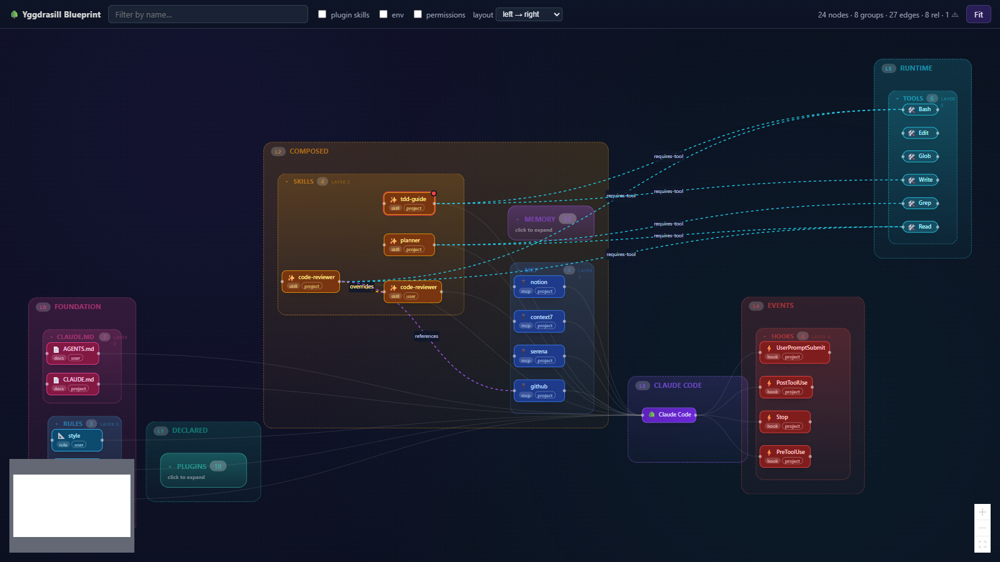
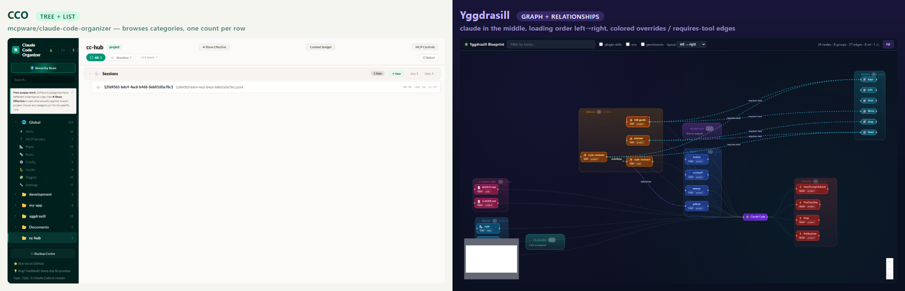
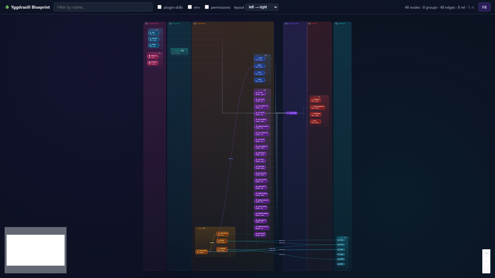
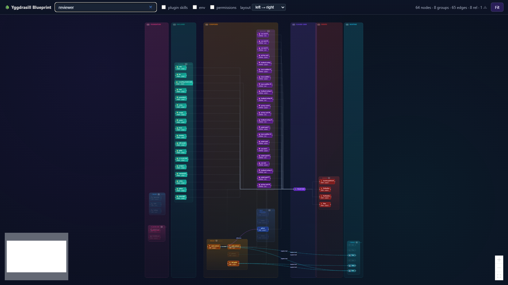

# Yggdrasill — Harness Graph

> **Harness relationship graph for Claude Code, inside VS Code.**

[](https://marketplace.visualstudio.com/items?itemName=yusuke-oki-06.yggdrasill)
[](https://marketplace.visualstudio.com/items?itemName=yusuke-oki-06.yggdrasill)
[](https://github.com/yusuke-oki-06/yggdrasill/actions/workflows/ci.yml)
[](LICENSE)

Yggdrasill walks your active workspace, reads every Claude Code surface (`settings.json`, `CLAUDE.md`, `AGENTS.md`, `.mcp.json`, `skills/`, `memory/`, hooks, plugins, permissions), and renders **how they connect** — not just *what exists*.



## Why another Claude Code tool?

There are already great extensions for browsing skills, listing MCP servers, and tracking session activity. None of them show **relationships**. A skill says it `requires-tool Bash` — which one? A plugin claims to *own* a skill — show me the link. A permission `allow` and a `deny` collide on the same pattern — make it impossible to miss. That is the gap Yggdrasill fills.



| | Browse | Tree | Graph | Relationships | Inside VS Code |
|---|---|---|---|---|---|
| CCO (mcpware) | ✓ | ✓ | — | — | — |
| Claude Code Tool Manager | ✓ | ✓ | — | — | — |
| Claudia / opcode | ✓ | — | — | — | — |
| Other VS Code skill browsers | ✓ | ✓ | — | — | ✓ |
| **Yggdrasill** | ✓ | ✓ | ✓ | ✓ | ✓ |

## Install

Install directly from the VS Code Marketplace:

```
ext install yusuke-oki-06.yggdrasill
```

Or from the command palette: `Extensions: Install Extensions` → search **Yggdrasill**.

Prefer offline? Download the latest `.vsix` from [GitHub Releases](https://github.com/yusuke-oki-06/yggdrasill/releases/latest) and run:

```bash
code --install-extension yggdrasill-0.1.0.vsix
```

## Features

- **Harness parser** — merges every layer of Claude Code config (user / project / local / plugin) into one validated model, capturing skill frontmatter and SKILL.md body references.
- **Sidebar Harness tree** — every category (Skills, Hooks, MCP, Memory, Permissions, Rules, CLAUDE.md, Env) with source grouping and per-plugin namespace folders, right inside VS Code's Activity Bar.
- **Blueprint graph** — react-flow + ELK layout with **Claude Code in the middle** and the harness composed left → right in load order. Each loading layer is wrapped in a labeled band (`L0 Foundation`, `L2 Composed`, `L4 Events`, …) so the pipeline reads like a diagram. Ownership edges route as clean right-angles; relationship edges stay curved and animated so they read as overlay annotations.
- **Hybrid density** — heavy categories (memory, plugins, …) auto-collapse to a summary card; click any card to expand it inline. Searching force-expands every category so hits stay reachable. Toggles for plugin skills / env / permissions hide the noisy long tail by default.
- **Seven relationship edge kinds** — `owns`, `overrides`, `conflicts`, `requires-tool`, `references`, `invokes`, `declared-in`. All derived purely from the parsed harness, no extra IO. `overrides` and `conflicts` render in bold gold/red so override resolution and policy collisions are unmissable.
- **Static analyzer** — five inconsistency rules surfaced via the standard `Problems` panel and a dedicated *Inconsistencies* sidebar category. Nodes flagged by the analyzer get a red badge in the graph.
- **Sessions watcher** — tails `~/.claude/projects/<slug>/*.jsonl` for the active workspace and pings you when Claude Code is waiting on `AskUserQuestion`, `ExitPlanMode`, or a permission request.
- **Screenshot-safe env** — env values are never rendered; Yggdrasill only shows whether each key is resolvable, so sharing a screenshot never leaks a PAT.

## Gallery

| Expand a collapsed category | Search focuses the graph |
|---|---|
|  |  |

## Quickstart

1. Open any Claude Code workspace in VS Code.
2. Click the 🌳 **Yggdrasill** icon in the Activity Bar.
3. From the sidebar header, run **`Yggdrasill: Open Blueprint`** (or use the command palette).
4. Use the toolbar to filter by name, switch layout direction, or reveal plugin skills / env vars / permissions.
5. Click any collapsed band (e.g. `PLUGINS 18 — click to expand`) to drill in; click a card to jump to its source file in the editor.

## Settings

| | Default | Description |
|---|---|---|
| `yggdrasill.notifications.enabled` | `true` | Show a notification when a Claude Code session needs your input. |
| `yggdrasill.parser.memoryRoot` | `""` | Override the inferred Claude Code memory directory. |

## Inconsistency rules

| Rule | Severity | Triggers |
|---|---|---|
| `skill.duplicate-name` | warning | Two skills share the same `name`. |
| `skill.missing-description` | warning | A skill has no `description` in frontmatter. |
| `mcp.missing-env` | warning | An MCP server references `${KEY}` that is not in `settings.json` or the shell. |
| `hook.empty-command` | warning | A hook entry has no command to run. |
| `plugin.missing-install` | warning | An enabled plugin is missing from `~/.claude/plugins/cache/`. |

## Loading-order layout

The Blueprint puts **Claude Code itself in the middle**, with the harness flowing into it from the left and the runtime triggering out to the right. Each layer renders as a labeled band:

```
 L0              L1               L2                      L3              L4            L5                     L6
 Foundation    → Declared       → Composed              → Claude Code   → Events      → Runtime             → Meta
 CLAUDE.md /     plugins /        skills / MCP /           (assembled      hooks         tools /                config
 rules           env              memory                   agent)                        permissions            files
```

Within each category column, entries are sorted by **source precedence** — project overrides at the top, then local, user, plugin — and prominent **`overrides`** edges connect higher-priority entries to the ones they shadow so you can see at a glance which definition wins.

## Security posture

- Production dependencies pass `npm audit` clean; dev-only CVEs (esbuild / vite / vitest) never ship in the `.vsix`.
- No `eval` / `new Function` / `child_process` in `src/`. No hardcoded secrets.
- WebView CSP: `default-src 'none'`; `script-src` is webview-origin + nonced; `img-src` allows `data:` (for react-flow SVG handles).
- Env values are redacted before render; only `(set)` / `(missing)` surfaces in the UI.

## Development

```bash
npm install
npm run dev          # esbuild watch (extension + WebView bundle)
# Press F5 in VS Code to launch an Extension Development Host
npm run typecheck
npm test
npm run package      # build .vsix
```

The repo holds two TypeScript projects: the extension (`src/`, Node CJS) and the React WebView (`media/blueprint/`, browser IIFE). Both are bundled by `esbuild.config.mjs`. A standalone demo (`demo/index.html` + synthetic fixture) renders the Blueprint without VS Code — useful for screenshots and CI regressions.

File an issue with the [Bug report](https://github.com/yusuke-oki-06/yggdrasill/issues/new/choose) or [Feature request](https://github.com/yusuke-oki-06/yggdrasill/issues/new/choose) template; the templates live under `.github/ISSUE_TEMPLATE/`.

## Roadmap

- Click-to-focus subgraph (1-2 hop neighborhood around a selected node).
- Edge-kind filter chips on the toolbar (toggle `invokes`, `overrides`, `requires-tool`, etc. independently).
- Selected-node detail panel with incoming / outgoing edge listing.
- Smarter edge aggregation when categories collapse (e.g. "12 references → MCP github" instead of the deduped single arrow we draw today).
- Slack-webhook variant of the input-required notification.
- Plugin → Hook / MCP `owns` extraction (parser extension).
- Memory-to-memory cross-reference detection.

## License

MIT © Yusuke Oki
